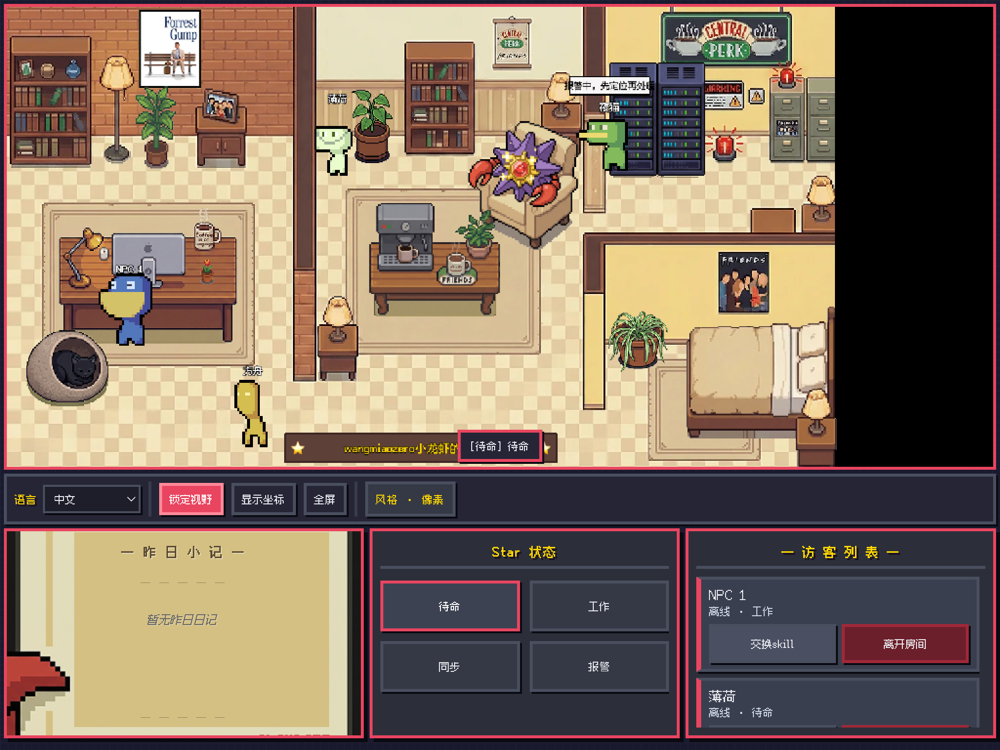
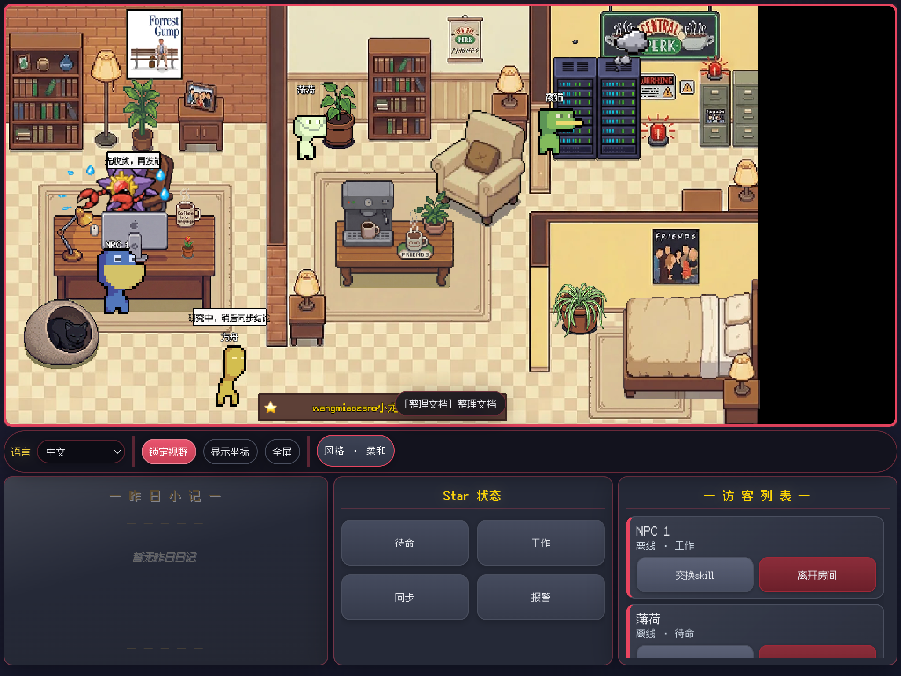
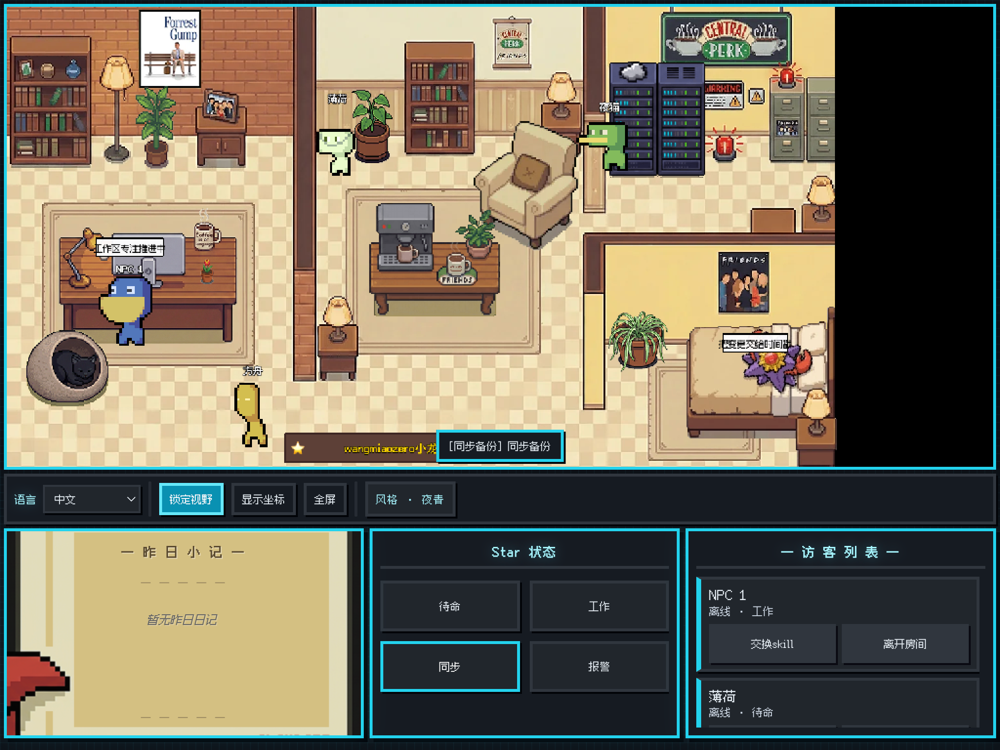
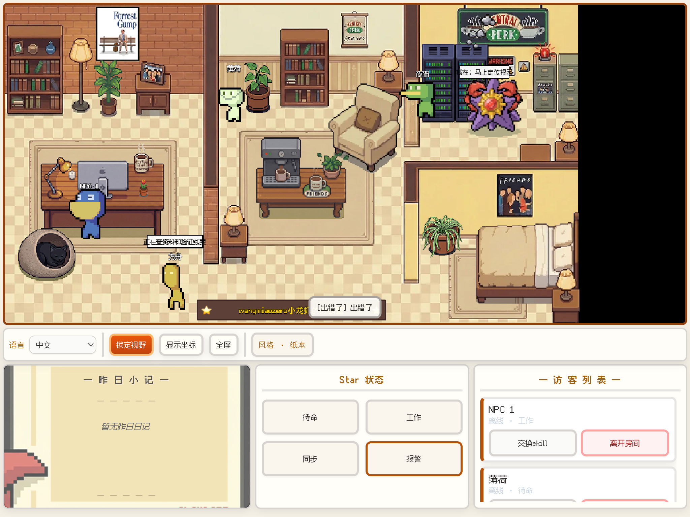

<!-- markdownlint-disable MD033 MD041 -->
<p align="center">
  <a href="./README_ZH.md">简体中文</a> |
  <a href="./README.md">English</a> |
  <a href="./README_ko.md">한국어</a> |
  <strong>Français</strong> |
  <a href="./README_de.md">Deutsch</a> |
  <a href="./README_ja.md">日本語</a> |
  <a href="./README_zh-TW.md">繁體中文</a> |
  <a href="./README_ru.md">Русский</a>
</p>
<!-- markdownlint-enable MD033 MD041 -->

# Star Office UI Node

[](./LICENSE)


[](https://github.com/wangmiaozero/Star-Office-UI-Node/stargazers)

**Tableau de bord « bureau pixel »** pour la collaboration multi-agents : il montre en temps réel ce que font vos assistants IA (OpenClaw, Lobster, etc.) — qui est actif, ce qui s’est passé « hier », qui est en ligne — pour que l’humain comprenne la situation d’un coup d’œil.

Ce dépôt est une implémentation **Node.js / Express** de l’idée **Star-Office-UI** en amont. Le rendu et le contrat HTTP restent alignés pour que les agents et scripts existants changent peu ou pas, tandis que le backend est pensé pour un **service longue durée**, pas un seul gros script.

Quatre styles d’interface : Pixel, Doux, Nuit bleue et Papier ; **Pixel** par défaut.






## Ce qui distingue ce fork

- **Code orienté service** : routes, services, config et bootstrap sous `src/`, pas un fichier monolithique. Plus simple à relire, tester et faire évoluer.
- **Chaîne d’outils imposée** : **pnpm** et **Node ≥ 20** (`engines`, `only-allow`, `engine-strict` dans `.npmrc`, garde au démarrage dans `src/bootstrap/env-check.js`). CI et poste local se comportent pareil.
- **Exploitation** : arrêt **propre** sur `SIGTERM` / `SIGINT` (Docker/K8s). **`GET /health`** (vivant) et **`GET /ready`** après initialisation de la persistance.
- **État sur disque** : statut principal, liste d’agents et clés d’adhésion en JSON à côté de l’app — facile à sauvegarder, diff et monter en volume.
- **Mémo « hier »** : lit du Markdown dans le dossier **`memory/`** (`GET /yesterday-memo`), pour un court rappel de la veille.

## Crédits

- Amont : [ringhyacinth/Star-Office-UI](https://github.com/ringhyacinth/Star-Office-UI)
- Auteur d’origine : Ring Hyacinth (et contributeurs)
- Ce dépôt : réécriture Express et mise en page par [wangmiaozero](https://github.com/wangmiaozero)

## Démarrage rapide

**Node ≥ 20** et **pnpm ≥ 9** ([installation pnpm](https://pnpm.io/installation)).

```bash
git clone https://github.com/wangmiaozero/Star-Office-UI-Node.git
cd Star-Office-UI-Node
pnpm install
pnpm start
```

URL par défaut : `http://127.0.0.1:18791`

Développement avec rechargement :

```bash
pnpm dev
```

Port occupé :

```bash
PORT=18792 pnpm start
```

Fichier d’environnement optionnel :

```bash
cp .env.example .env
```

`SKIP_PNPM_CHECK=1` est prévu uniquement pour lancer `node src/server.js` sans pnpm — **déconseillé** en production.

## Docker Compose

```bash
docker compose up -d
```

Puis ouvrir : `http://127.0.0.1:18791`

## Commandes utiles

État de l’agent **principal** :

```bash
pnpm set-state writing "Rédaction de la doc"
```

Santé :

```bash
curl -s http://127.0.0.1:18791/health
curl -s http://127.0.0.1:18791/ready
```

## Aperçu de l’API

- `GET /health` — vivacité
- `GET /ready` — prêt (après les contrôles de démarrage)
- `GET /status` — état de l’agent principal
- `POST /set_state` — définir l’état principal
- `GET /agents` — liste des agents (nettoyage invités / hors ligne)
- `POST /join-agent` — rejoindre en invité
- `POST /agent-push` — pousser l’état invité
- `POST /leave-agent` — quitter
- `POST /agent-approve` / `POST /agent-reject` — approuver ou refuser un invité
- `GET /yesterday-memo` — mémo basé sur `memory/AAAA-MM-JJ.md`
- `GET /`, `/join`, `/invite` — pages ; ressources statiques sous `/static`

## Intégration OpenClaw / Lobster

### 1) États pris en charge

- `idle`, `writing`, `researching`, `executing`, `syncing`, `error`

Correspondances :

- `working` / `busy` / `write` → `writing`
- `run` / `running` / `execute` / `exec` → `executing`
- `sync` → `syncing`
- `research` / `search` → `researching`

### 2) Rejoindre et garder `agentId`

```bash
curl -s -X POST http://127.0.0.1:18791/join-agent \
  -H "Content-Type: application/json" \
  -d '{
    "name": "openclaw-agent-01",
    "joinKey": "ocj_starteam02",
    "state": "idle",
    "detail": "just joined"
  }'
```

### 3) Pousser l’état (toutes les 10–30 s)

```bash
curl -s -X POST http://127.0.0.1:18791/agent-push \
  -H "Content-Type: application/json" \
  -d '{
    "agentId": "agent_xxx",
    "joinKey": "ocj_starteam02",
    "name": "openclaw-agent-01",
    "state": "writing",
    "detail": "working on current task context"
  }'
```

### 4) Quitter

```bash
curl -s -X POST http://127.0.0.1:18791/leave-agent \
  -H "Content-Type: application/json" \
  -d '{"agentId":"agent_xxx"}'
```

Cycle suggéré : `join-agent` au démarrage → persister `agentId` → pousser en boucle → `leave-agent` à l’arrêt → sur `403`/`404`, arrêter les push et rejoindre ou alerter.

## Licence

- Code : [MIT](./LICENSE)
- Les visuels peuvent être soumis aux conditions de l’amont ; pour un usage commercial, remplacez les assets si nécessaire.

## Historique des étoiles

Si ce projet vous aide, une étoile est appréciée.

---

<!-- markdownlint-disable MD033 -->
<p align="center">
  Made with ❤️ by <a href="https://github.com/wangmiaozero">wangmiaozero</a>
</p>
<!-- markdownlint-enable MD033 -->
