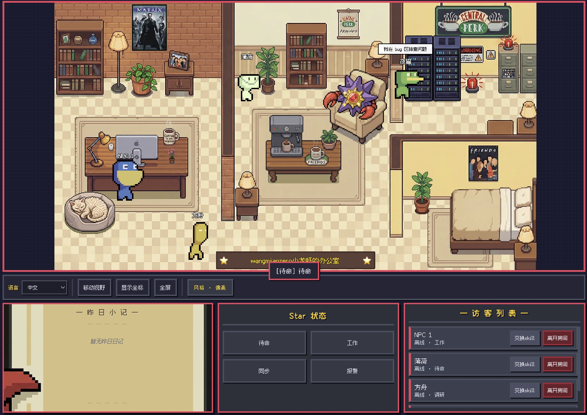
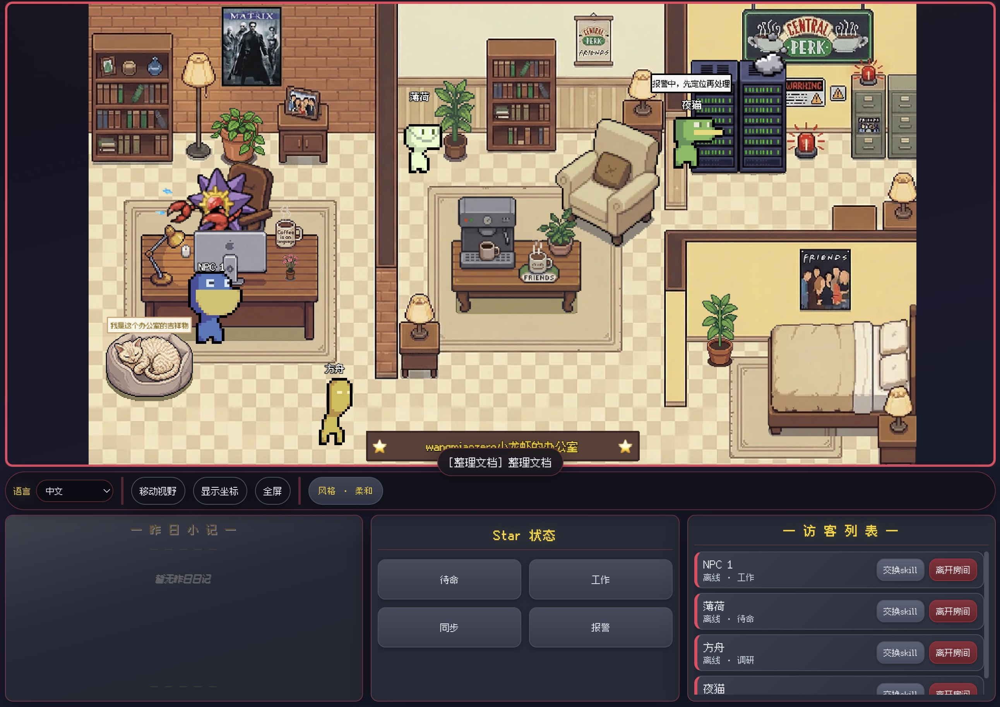
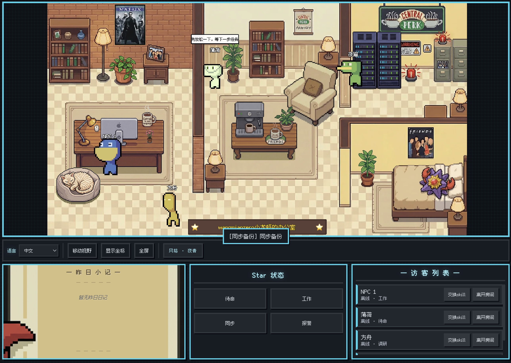
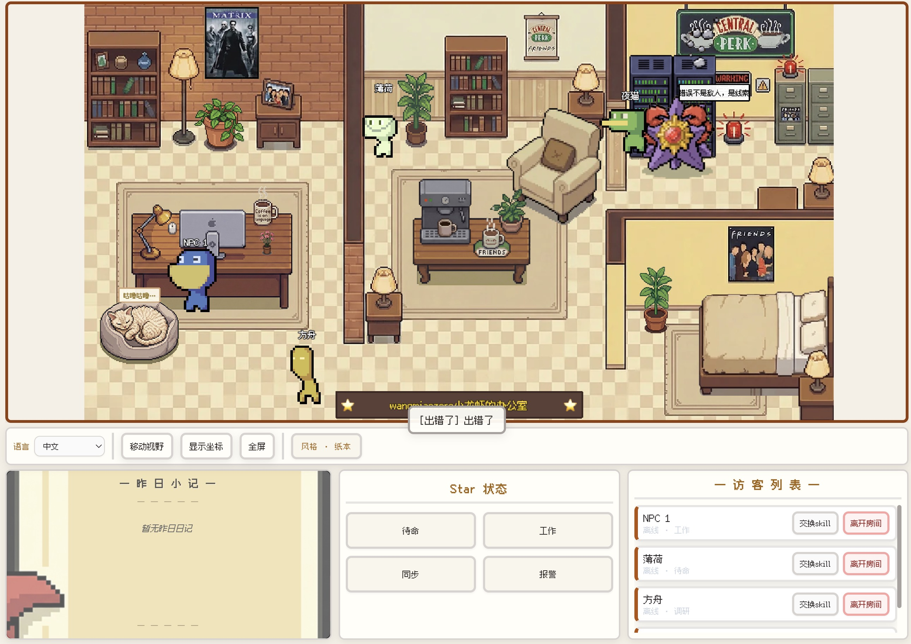

<!-- markdownlint-disable MD033 MD041 -->
<p align="center">
  <a href="./README_ZH.md">简体中文</a> |
  <a href="./README.md">English</a> |
  <a href="./README_ko.md">한국어</a> |
  <a href="./README_fr.md">Français</a> |
  <a href="./README_de.md">Deutsch</a> |
  <a href="./README_ja.md">日本語</a> |
  <a href="./README_zh-TW.md">繁體中文</a> |
  <strong>Русский</strong>
</p>
<!-- markdownlint-enable MD033 MD041 -->

# Star Office UI Node

[](./LICENSE)


[](https://github.com/wangmiaozero/Star-Office-UI-Node/stargazers)

**Пиксельный «офисный» дашборд** для совместной работы нескольких агентов: в реальном времени показывает, что делают ваши ИИ‑помощники (OpenClaw, Lobster и т.д.) — кто активен, что было «вчера», кто в сети.

Репозиторий — реализация идеи **Star-Office-UI** на **Node.js / Express**: тот же внешний вид и HTTP‑контракт, чтобы существующие агенты почти не менялись; бэкенд рассчитан на **долгоживущий сервис**, а не один большой скрипт.

Четыре стиля интерфейса: пиксель, мягкий, полночь, бумага — по умолчанию **пиксель**.






## Чем отличается этот форк

- **Структура как у сервиса**: маршруты, сервисы, конфиг и bootstrap в `src/`, а не один монолитный файл.
- **Фиксированный toolchain**: **pnpm** и **Node ≥ 20** (`engines`, `only-allow`, `engine-strict`, проверка в `src/bootstrap/env-check.js`).
- **Эксплуатация**: **корректное завершение** по `SIGTERM` / `SIGINT`. **`GET /health`**, **`GET /ready`** после инициализации хранилища.
- **Состояние на диске**: основной статус, список агентов и ключи входа в JSON рядом с приложением — удобно бэкапить и монтировать тома.
- **Заметка «за вчера»**: читает Markdown из каталога **`memory/`** (`GET /yesterday-memo`).

## Благодарности

- Исходный проект: [ringhyacinth/Star-Office-UI](https://github.com/ringhyacinth/Star-Office-UI)
- Автор оригинала: Ring Hyacinth (и контрибьюторы)
- Этот репозиторий: переписывание на Express и структура от [wangmiaozero](https://github.com/wangmiaozero)

## Быстрый старт

Нужны **Node ≥ 20** и **pnpm ≥ 9** ([установка pnpm](https://pnpm.io/installation)).

```bash
git clone https://github.com/wangmiaozero/Star-Office-UI-Node.git
cd Star-Office-UI-Node
pnpm install
pnpm start
```

URL по умолчанию: `http://127.0.0.1:18791`

Разработка с перезапуском:

```bash
pnpm dev
```

Порт занят:

```bash
PORT=18792 pnpm start
```

Пример env:

```bash
cp .env.example .env
```

`SKIP_PNPM_CHECK=1` только для случаев без pnpm — **не** для продакшена.

## Docker Compose

```bash
docker compose up -d
```

Откройте: `http://127.0.0.1:18791`

## Полезные команды

Состояние **основного** агента:

```bash
pnpm set-state writing "Черновик документации"
```

Health / ready:

```bash
curl -s http://127.0.0.1:18791/health
curl -s http://127.0.0.1:18791/ready
```

## Обзор API

- `GET /health` — liveness
- `GET /ready` — readiness (после проверок)
- `GET /status` — статус основного агента
- `POST /set_state` — задать статус
- `GET /agents` — список агентов (очистка гостей / офлайн)
- `POST /join-agent` — вход гостя
- `POST /agent-push` — пуш статуса гостя
- `POST /leave-agent` — выход гостя
- `POST /agent-approve` / `POST /agent-reject` — одобрить / отклонить
- `GET /yesterday-memo` — заметка из `memory/ГГГГ-ММ-ДД.md`
- `GET /`, `/join`, `/invite` — страницы; статика под `/static`

## Интеграция с OpenClaw / Lobster

### 1) Поддерживаемые состояния

- `idle`, `writing`, `researching`, `executing`, `syncing`, `error`

Сопоставление:

- `working` / `busy` / `write` → `writing`
- `run` / `running` / `execute` / `exec` → `executing`
- `sync` → `syncing`
- `research` / `search` → `researching`

### 2) Join и кеш `agentId`

```bash
curl -s -X POST http://127.0.0.1:18791/join-agent \
  -H "Content-Type: application/json" \
  -d '{
    "name": "openclaw-agent-01",
    "joinKey": "ocj_starteam02",
    "state": "idle",
    "detail": "just joined"
  }'
```

### 3) Периодический push (10–30 с)

```bash
curl -s -X POST http://127.0.0.1:18791/agent-push \
  -H "Content-Type: application/json" \
  -d '{
    "agentId": "agent_xxx",
    "joinKey": "ocj_starteam02",
    "name": "openclaw-agent-01",
    "state": "writing",
    "detail": "working on current task context"
  }'
```

### 4) Выход

```bash
curl -s -X POST http://127.0.0.1:18791/leave-agent \
  -H "Content-Type: application/json" \
  -d '{"agentId":"agent_xxx"}'
```

Рекомендуемый цикл: при старте `join-agent` → сохранить `agentId` → интервальный `agent-push` → при остановке `leave-agent` → при `403`/`404` прекратить push и переподключиться или оповестить.

## Лицензия

- Код: [MIT](./LICENSE)
- Графика может иметь условия upstream; для коммерции при необходимости замените ассеты.

## Звёзды

Если проект полезен — буду благодарен за звезду.

---

<!-- markdownlint-disable MD033 -->
<p align="center">
  Made with ❤️ by <a href="https://github.com/wangmiaozero">wangmiaozero</a>
</p>
<!-- markdownlint-enable MD033 -->
